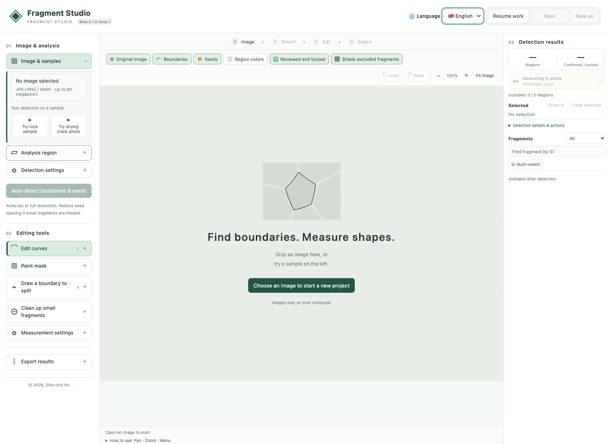

# Fragstudio — Beta 0.1.0-beta.1

画像から破片の境界を抽出し、人が修正して形や大きさを計測するツールです。日本語・英語に対応しています。

## はじめに

1. [Fragstudio-0.1.0-beta.1.html](./Fragstudio-0.1.0-beta.1.html) をダウンロードします。GitHub上ではファイルを開いて **Download raw file** を選択してください。
2. ダウンロードしたHTMLをブラウザーで開きます。
3. 「画像を選んで新規プロジェクトを作成」で画像を選ぶか、サンプルを試します。
4. 必要に応じて解析領域を指定し、境界・母点を自動抽出します。
5. 境界を修正し、計測結果をCSVやPNGで出力します。

プログラムとサンプル画像はHTMLに内蔵されています。インストールやサーバーの準備は不要です。GitHubのファイル閲覧画面ではアプリは動作しません。

## 基本操作

- **画像の移動**：境界や点のない部分をドラッグ、Space＋ドラッグ、またはトラックパッドの2本指スクロール。
- **拡大・縮小**：ピンチ、Ctrl＋マウスホイール、または画面の＋／−ボタン。
- **境界の修正**：曲線を選び、制御点や接続点をドラッグ。
- **操作メニュー**：副ボタンクリック（右クリック／2本指クリック）。クリックした場所に応じて操作が変わります。
- **確認・固定**：確認を終えた破片を固定します。再編集する場合は固定を解除してください。
- **マスク**：計測に使わない部分をブラシで塗ります。

画面上部のチェックボックスで、元画像・境界・母点・領域の色などの表示を切り替えられます。

## 作業の保存と再開

- **上書き保存**：開いたプロジェクトに保存します。Ctrl／Command＋Sでも実行できます。新規プロジェクトでは保存先を選択します。
- **別名で保存**：プロジェクトを別ファイルとしてダウンロードします。元の上書き先は変更しません。
- **作業を再開**：保存した `.fragment` ファイルを開きます。

初期ファイル名は `Fragstudio_YYYYMMDD.fragment` です。プロジェクトには元画像と編集内容が含まれます。作業はこまめに保存してください。

直接の上書き保存と、前回使用したフォルダーの記憶は、対応するブラウザーでのみ利用できます。非対応の場合は「別名で保存」を使用してください。ブラウザーから書き込み許可を求められる場合があります。

## 計測と出力

実寸で計測する場合は「計測・集計の設定」でスケールを設定します。設定しない場合はピクセル単位になります。

画像・解析領域の端に触れる破片と、マスクを含む破片は、初期設定では集計対象外です。CSVには対象外の破片も含まれるため、集計には `included=true` の行を使ってください。

CSV、破片の切り抜きPNG、境界付き全体画像、元画像に透過色を重ねた全体画像などを出力できます。

## 動作環境・注意事項

- Web Worker、OffscreenCanvas、createImageBitmapに対応するブラウザーが必要です。
- 最大8000万画素です。ただし、画像の複雑さやメモリー容量によって処理時間・実用上の上限が変わります。
- ベータ版です。自動抽出した境界や計測値は、人が確認して使用してください。
- 取り消し履歴には上限があり、古い履歴は削除されます。
- Windows実機での動作確認は未実施です。

## データの扱い

画像処理はブラウザー内で行い、画像を外部サーバーへ送信する機能はありません。言語設定はブラウザー内に保存されます。

`.fragment` ファイルには元画像・画像名・編集内容が含まれます。公開したくないデータを含むプロジェクトはアップロードしないでください。

---

## English quick start

Fragstudio extracts fragment boundaries from images and lets you edit them and measure fragment size and shape. The interface supports Japanese and English.

1. Download [Fragstudio-0.1.0-beta.1.html](./Fragstudio-0.1.0-beta.1.html). On GitHub, use **Download raw file**.
2. Open the downloaded HTML in your browser. No installation or server is needed; the app and sample images are included.
3. Choose an image or try a sample. Set an analysis area if needed, run automatic detection, then review and edit the boundaries.
4. Export measurements as CSV or images as PNG.

Drag an empty area or use Space+drag to pan. Pinch or use Ctrl+mouse wheel to zoom. Right-click (or click with two fingers) for context actions. Drag curve handles to edit boundaries.

**Save** uses Ctrl/Command+S and writes to the current project file in supporting browsers. For a new project, choose a save location. **Save as** downloads a separate `.fragment` copy and keeps the original overwrite target. Open a saved project to resume work. Direct overwrite and remembered folders depend on browser support; otherwise, use Save as.

Set a scale for physical units; otherwise measurements use pixels. Fragments touching the image or analysis-area edge, or containing a mask, are excluded by default. CSV files also contain excluded fragments: use rows with `included=true` for analysis.

This is a beta release. Review automatic boundaries and measurements. The app supports up to 80 megapixels, subject to available memory and image complexity. It requires Web Worker, OffscreenCanvas and createImageBitmap support. Windows has not been tested on a physical device. Undo history is limited, so save regularly.

Images are processed locally, with no image upload to an external server. Project files contain the original image, image name and edits; do not publish private project files.

© 2026, Shin-ichi Ito
